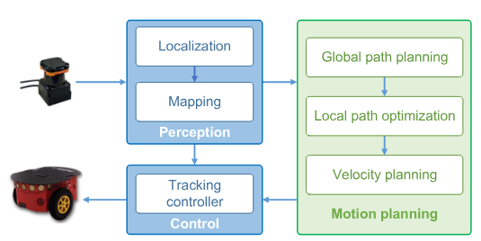
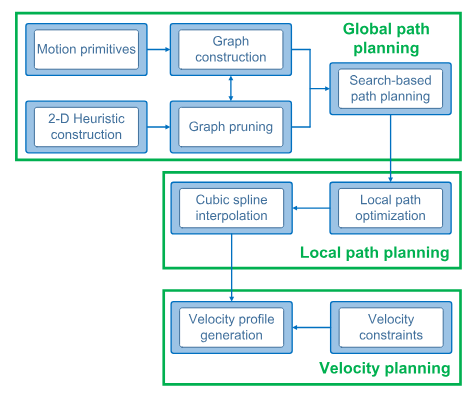
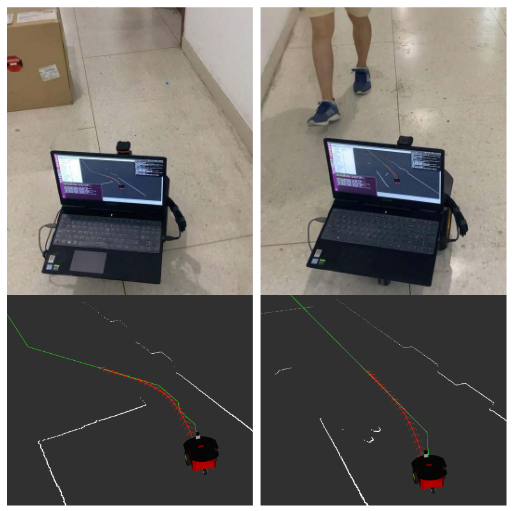
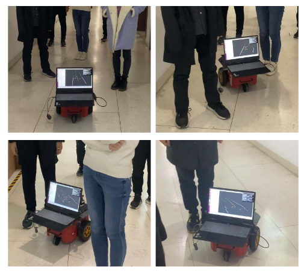
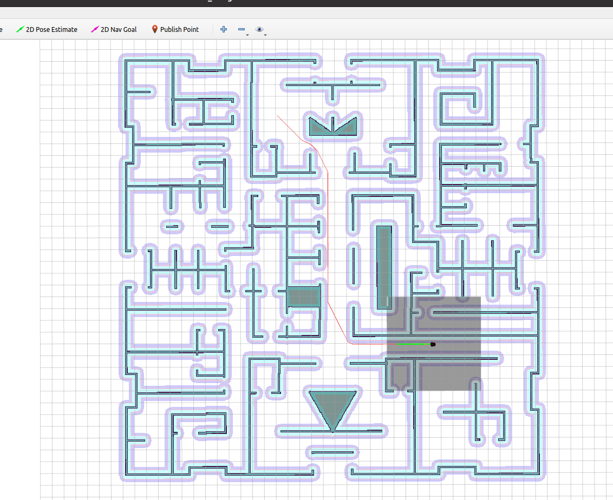

# E3MoP

To solve the autonomous navigation problem in complex environments, an  efficient motion planning approach **E3MoP** is newly presented.  Considering the challenges from large-scale, partially unknown complex  environments, a three-layer motion planning framework is elaborately  designed, including global path planning, local path optimization, and  time-optimal velocity planning. Compared with existing approaches, the  novelty of this work is twofold: 1) a novel heuristic-guided pruning  strategy of motion primitives is proposed and fully integrated into the  state lattice-based global path planner to further improve the  computational efficiency of graph search, and 2) a new soft-constrained  local path optimization approach is proposed, wherein the sparse-banded  system structure of the underlying optimization problem is fully  exploited to efficiently solve the problem.

<p align="center">
 
 
</p>

<p align="center">
 
 
</p>

**Related Paper**: [Paper on IEEE](https://ieeexplore.ieee.org/document/9627934)

> J. Wen, X. Zhang, H. Gao, J. Yuan and Y. Fang, "E3MoP: Efficient Motion  Planning Based on Heuristic-Guided Motion Primitives Pruning and Path  Optimization With Sparse-Banded Structure," in *IEEE Transactions on Automation Science and Engineering*, vol. 19, no. 4, pp. 2762-2775, Oct. 2022.

If it is useful to you, please cite our paper and ⭐️ our code.

## Prerequisites

1. E$^3$MoP has been tested on **Ubuntu 20.04 with ROS Noetic**,  please run the following commands to install required dependencies:

```bash
$ sudo apt install ros-noetic-navigation ros-noetic-teb-local-planner
```

2. Please install Ceres solver following the official [installation tutorial](http://ceres-solver.org/installation.html).

## Build E3MoP

Then simply clone and compile our package:

```bash
cd ${YOUR_WORKSPACE_PATH}/src
git clone git@github.com:NKU-MobFly-Robotics/p3dx.git
git clone git@github.com:NKU-MobFly-Robotics/E3MoP.git
cd ../ 
catkin_make
```

## Known issues

One possible solution to compile errors is to compile and install the following four packages in sequence: 

1. lattice_path_planner
2. distance_map_layer
3. path_smoother_base
4. ceres_path_smoother

## Run E3MoP

```bash
source devel/setup.bash & roslaunch move_base_benchmark benchmark.launch 
```

Then, use rviz's 2D Nav Goal to set the navigation target point. If a red global path and a green local path appear as shown in the following figure, and the robot starts moving, it proves that it has been successfully started.

<p align="center">
 
</p>

## Acknowledgements

We sincerely appreciate the following open source projects: [local_planning_benchmark](https://github.com/NKU-MobFly-Robotics/local-planning-benchmark), [teb_local_planner](), [p3dx](https://github.com/NKU-MobFly-Robotics/p3dx), [Ceres_solver](http://ceres-solver.org/).
